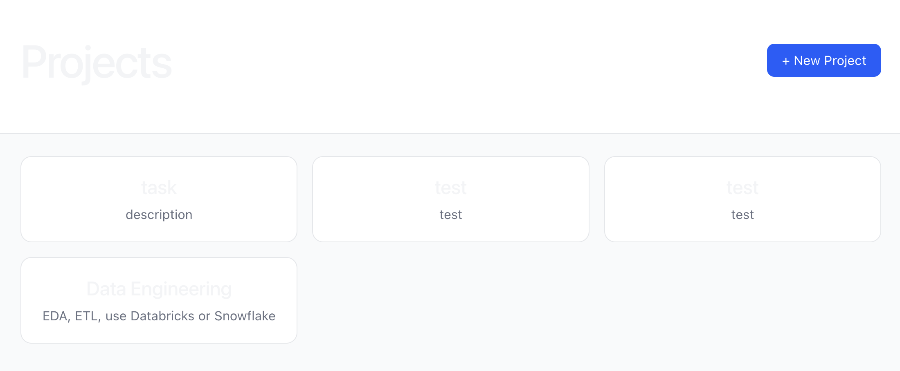
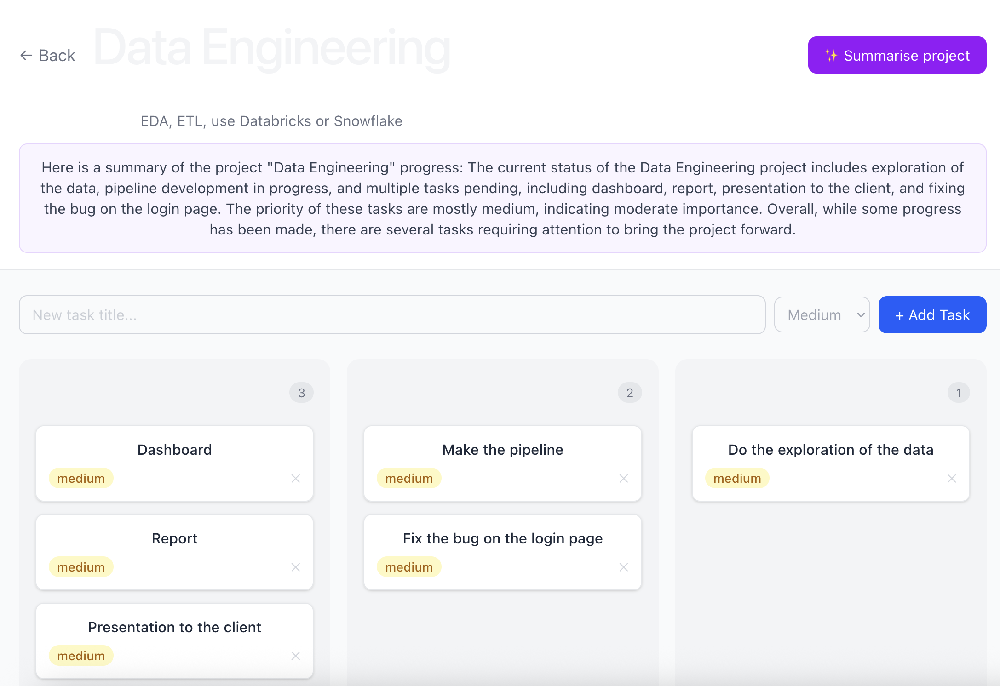

# Full-Stack AI-Powered Kanban Platform — React, FastAPI, PostgreSQL & Local LLM Integration


---

## Executive Summary

Small engineering teams lose hours every week to manual status reporting and fragmented task tracking. TaskBoard is a self-hostable, production-ready Kanban platform that centralises task management and eliminates manual reporting through on-premise AI summaries. Built with React, FastAPI, PostgreSQL, and a local Llama 3.2 model, the platform deploys with a single command, passes a full automated CI test suite on every push, and generates plain-English project health reports in under 10 seconds from live task data — with zero external API dependency.

---

## Business Problem

Small and medium engineering teams face two compounding problems: lack of task visibility and excessive time spent on status communication. Without a centralised, lightweight system, work gets lost, priorities blur, and managers spend time chasing updates instead of unblocking their team. Enterprise tools like Jira solve this but introduce significant cost and setup overhead that small teams cannot justify. TaskBoard solves this by providing a self-hostable alternative that any team can spin up in minutes, with an AI layer that surfaces project health automatically — removing the need for manual reporting entirely.

---

## Methodology

The application follows a three-tier REST architecture — React frontend, FastAPI backend, PostgreSQL database — with JWT-based stateless authentication to ensure secure, scalable session management. The AI summariser uses structured prompt engineering to inject live task data into a context window and queries a locally hosted Llama 3.2 model via Ollama, keeping all data on-premise. Axios interceptors handle automatic token expiry and logout, ensuring a seamless and secure user experience. The test suite uses dependency injection to swap PostgreSQL for an in-memory SQLite database, and mocks all Ollama HTTP calls, making tests fast, isolated, and CI-friendly.

---

## Technical Skills

| Layer | Technologies |
|---|---|
| Frontend | React, TypeScript, Tailwind CSS, React Query, Zustand, dnd-kit |
| Backend | Python, FastAPI, SQLAlchemy, Pydantic v2, JWT authentication |
| Database | PostgreSQL, relational schema design |
| AI | Ollama, Llama 3.2, prompt engineering, local LLM inference |
| DevOps | Docker, Docker Compose, nginx reverse proxy, GitHub Actions CI |
| Testing | pytest, TestClient, AsyncMock, fixture-based integration testing |

Notable implementation details: axios interceptors for automatic 401 handling and token refresh, dependency injection for database session management, Pydantic v2 schema validation on all API boundaries, drag-and-drop state reconciliation via dnd-kit with optimistic backend updates, and mocked async HTTP clients for reliable LLM testing in CI.

---

## Results and Recommendations





The platform delivers three capabilities that directly reduce operational overhead for engineering teams.

One-command deployment via Docker Compose eliminates environment setup friction entirely, making adoption viable for any team regardless of infrastructure background. The Kanban board with drag-and-drop status updates gives teams a live view of work in progress, replacing ad-hoc Slack threads and spreadsheet tracking. The LLM summariser generates a project health report in under 10 seconds from live task data, replacing manual standups and status emails.

For teams adopting this platform, the recommended next step is integrating automated daily summaries with Slack or email, so project health is pushed to the team rather than requiring anyone to actively check it.

---

## Next Steps & Limitations

**Next steps:**
- Add a CD pipeline to automatically deploy to a cloud platform such as Render or Railway on every green CI build, completing the full CI/CD loop
- Add WebSocket support for real-time board updates across multiple simultaneous users
- Implement role-based access control so teams can collaborate on shared boards with owner and contributor permissions
- Integrate Slack and email webhooks for automated daily project summaries pushed to team channels
- Extend the LLM layer to suggest task priorities and auto-generate initial task lists from a project description

**Limitations:**
- The application currently runs locally via Docker Compose and is not yet deployed to a public URL. A cloud platform such as Render or Railway would make it accessible without any local setup
- The LLM summariser requires Ollama running on the host machine with sufficient RAM to load Llama 3.2 (approximately 4GB). A cloud-hosted model endpoint would remove this hardware constraint in a production deployment
- Authentication is per-user and projects are not shared between accounts, meaning collaborative multi-user workflows on the same board are not yet supported
- There is no activity log or audit trail, which limits accountability in team environments where change history matters

---

## Local Setup

**Prerequisites:** Docker Desktop and Ollama installed on your machine.

**1. Pull the LLM model**
```bash
ollama pull llama3.2
```

**2. Start Ollama so Docker can reach it**
```bash
OLLAMA_HOST=0.0.0.0 ollama serve
```

**3. Clone and run**
```bash
git clone https://github.com/Rakmanimal-theAI/taskboard
cd taskboard
docker-compose up --build
```

App runs at `http://localhost`. API docs at `http://localhost/api/docs`.

**Running tests locally**
```bash
cd backend
pip install -r requirements.txt
pytest tests/ -v
```

Tests use SQLite and mock all Ollama calls — no running services required.
